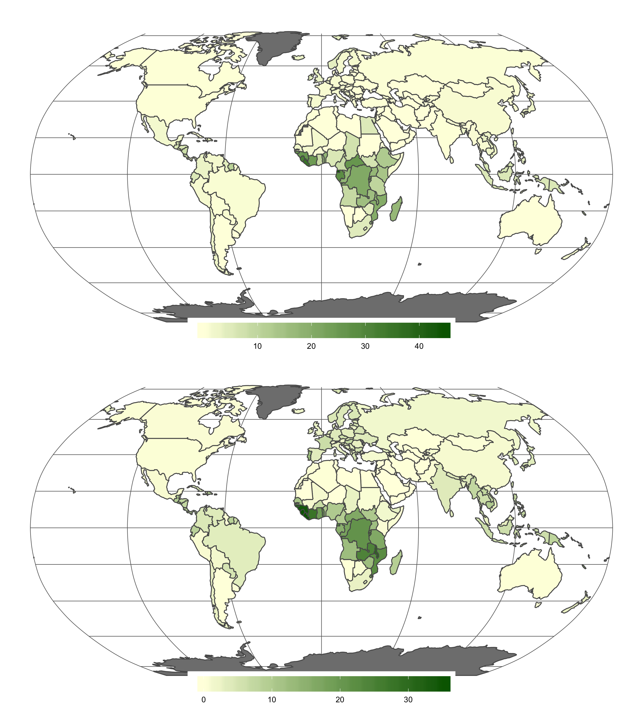
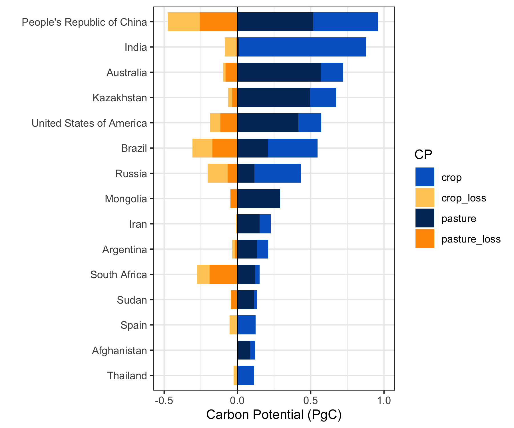
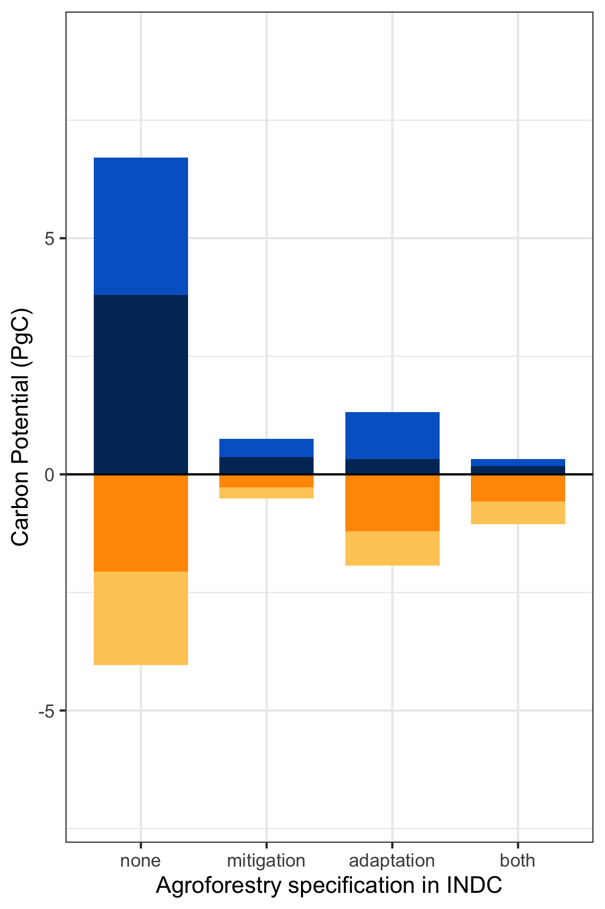
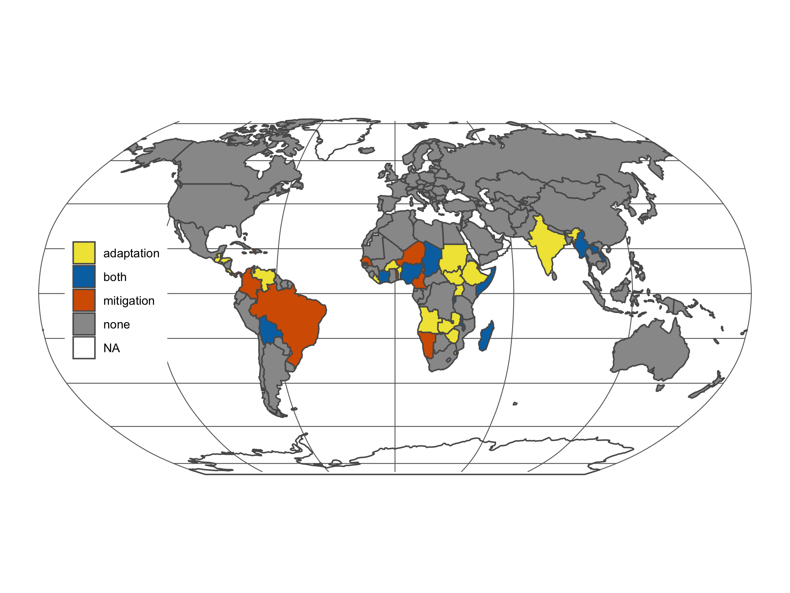
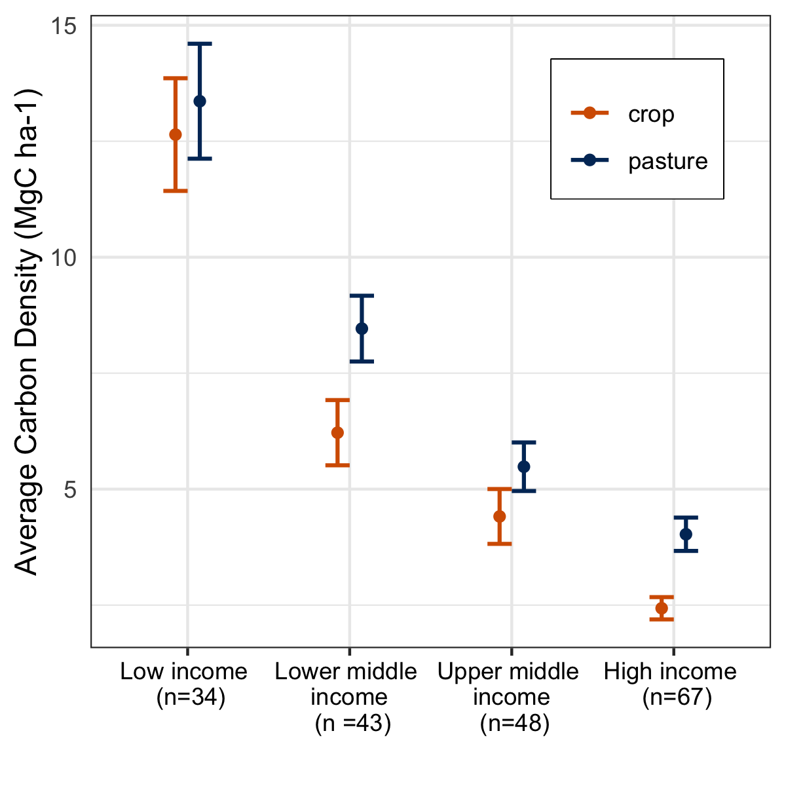
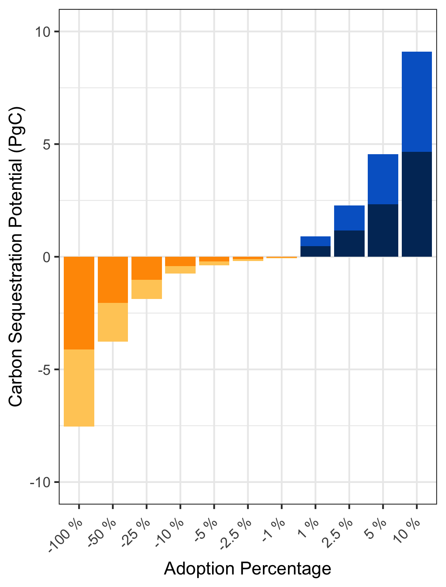

Figures
================
Millie Chapman
12/14/2019

``` r
library("rnaturalearth")
library("rnaturalearthdata")
library(tidyverse)
```

    ## ── Attaching packages ─────────────────────────────────────────────────────────────────────────────── tidyverse 1.3.0 ──

    ## ✔ ggplot2 3.2.1     ✔ purrr   0.3.3
    ## ✔ tibble  2.1.3     ✔ dplyr   0.8.3
    ## ✔ tidyr   1.0.0     ✔ stringr 1.4.0
    ## ✔ readr   1.3.1     ✔ forcats 0.4.0

    ## ── Conflicts ────────────────────────────────────────────────────────────────────────────────── tidyverse_conflicts() ──
    ## ✖ dplyr::filter() masks stats::filter()
    ## ✖ dplyr::lag()    masks stats::lag()

``` r
library(gridExtra)
```

    ## 
    ## Attaching package: 'gridExtra'

    ## The following object is masked from 'package:dplyr':
    ## 
    ##     combine

``` r
IUCN_agroforestry  <- read_csv("../data/INDCCCAFS.csv") %>%
  mutate(value = ifelse(mitigation == 1 & both == 0, "mitigation", 
                        ifelse(adaptation == 1 & both == 0, "adaptation", 
                               ifelse(adaptation == 0 & mitigation == 0, "none", "both"))))
```

    ## Parsed with column specification:
    ## cols(
    ##   NAME = col_character(),
    ##   ISO_A3 = col_character(),
    ##   `Submitted an INDC` = col_double(),
    ##   mitigation = col_double(),
    ##   adaptation = col_double(),
    ##   both = col_double()
    ## )

``` r
summary_country <-read_csv("../output/summary_country.csv") %>%
  left_join(IUCN_agroforestry) %>%
  rename(IUCN = value)
```

    ## Warning: Missing column names filled in: 'X1' [1]

    ## Parsed with column specification:
    ## cols(
    ##   X1 = col_double(),
    ##   NAME_EN = col_character(),
    ##   ISO_A3 = col_character(),
    ##   area_pasture = col_double(),
    ##   carbon_pasture = col_double(),
    ##   density_pasture = col_double(),
    ##   area_crop = col_double(),
    ##   carbon_crop = col_double(),
    ##   density_crop = col_double(),
    ##   total_carbon = col_double(),
    ##   total_area = col_double()
    ## )

    ## Joining, by = "ISO_A3"

``` r
summary_country <- summary_country %>%
  mutate(iso_a3 = ISO_A3,
         admin = NAME_EN) 

world <- ne_countries(scale = "small", returnclass = "sf") %>%
  left_join(summary_country, by = "iso_a3") %>%
  select(iso_a3, density_crop, density_pasture, IUCN) 

quantile_crop <- quantile(world$density_crop, na.rm = TRUE)
```

``` r
crop <- ggplot(data = world) +
  geom_sf(aes(fill = density_crop))  +
  scale_fill_gradient(low = "lightyellow",
                      high = "darkgreen",space = "Lab",
                      na.value = "grey50", guide = "colourbar", aesthetics = "fill") +
  coord_sf(crs = "+proj=robin +lon_0=0w") + theme_minimal() + 
  theme(legend.direction = "horizontal", 
        legend.position = c(0.5, 0),
        legend.title = element_blank(),
        legend.background = element_rect(fill="white",  size=0, linetype="dotted")) +
  theme(legend.key.width = unit(2, "cm")) +
  theme(panel.grid.major = element_line(color = gray(.4), size = 0.3))


pasture <- ggplot(data = world) +
  geom_sf(aes(fill = density_pasture))  +
  scale_fill_gradient(low = "lightyellow",
                      high = "darkgreen",space = "Lab",
                      na.value = "grey50", guide = "colourbar", aesthetics = "fill") +
  coord_sf(crs = "+proj=robin +lon_0=0w") + theme_minimal() + 
  theme(legend.direction = "horizontal", 
        legend.position = c(0.5, 0),
        legend.title = element_blank(),
        legend.background = element_rect(fill="white",  size=0, linetype="dotted")) +
  theme(legend.key.width = unit(2, "cm")) +
  theme(panel.grid.major = element_line(color = gray(.4), size = 0.3))

grid.arrange(crop, pasture, ncol = 1)
```

<!-- -->

``` r
IUCN <- read.csv("../output/summary_all.csv") %>%
  select(value, area_pasture, area_crop, carbon_pasture, carbon_crop) %>%
  #mutate(mitigation = as.factor(mitigation)) %>%
  #mutate_all(funs(ifelse(is.na(.), 0, .))) %>%
  group_by(value) %>%
  summarise(pasture = sum(carbon_pasture, na.rm = TRUE)/1000,
            crop = sum(carbon_crop, na.rm = TRUE)/1000) %>%
  gather(-value, key = "CP", value = "carbon_standing")
```

    ## Warning: Factor `value` contains implicit NA, consider using
    ## `forcats::fct_explicit_na`

``` r
IUCN_potential <- read.csv("../output/potential.csv") %>% left_join(IUCN_agroforestry, by = c("ISO_A3")) %>%
  select(carbon_potential, CP, value) %>%
  #mutate_all(funs(ifelse(is.na(.), 0, .))) %>%
  #select(mitigation.y, carbon_potential, CP) %>%
  #mutate(mitigation = as.factor(mitigation.y)) %>%
  #mutate_all(funs(ifelse(is.na(.), 0, mitigation))) %>%
  group_by(value, CP) %>%
  summarise(carbon_potential = sum(carbon_potential, na.rm = TRUE)/10^9/10) %>%
  left_join(IUCN, by = c("value","CP"))
```

    ## Warning: Column `ISO_A3` joining factor and character vector, coercing into
    ## character vector

    ## Warning: Column `value` joining character vector and factor, coercing into
    ## character vector

    ## Warning: Column `CP` joining factor and character vector, coercing into
    ## character vector

``` r
IUCN_potential<- IUCN_potential %>% remove_missing() %>%
  rename(INDC = value)
```

    ## Warning: Removed 2 rows containing missing values.

``` r
standing <- read.csv("../output/summary_all.csv") %>%
  select(NAME_EN, ISO_A3, carbon_pasture, carbon_crop) %>%
  #mutate(mitigation = as.factor(mitigation)) %>%
  ##mutate_all(funs(ifelse(is.na(.), 0, .))) %>%
  group_by(ISO_A3) %>%
  summarise(pasture_loss = sum(carbon_pasture, na.rm = TRUE)*(-1),
            crop_loss = sum(carbon_crop, na.rm = TRUE)*(-1)) %>%
  gather(-ISO_A3, key = "CP", value = "standing") %>%
  #mutate(mitigation = as.factor(mitigation)) %>%
  group_by(ISO_A3, CP) %>%
  summarise(carbon= sum(standing)/1000) %>%
  mutate(CP = as.factor(CP))
```

    ## Warning: Factor `ISO_A3` contains implicit NA, consider using
    ## `forcats::fct_explicit_na`
    
    ## Warning: Factor `ISO_A3` contains implicit NA, consider using
    ## `forcats::fct_explicit_na`
    
    ## Warning: Factor `ISO_A3` contains implicit NA, consider using
    ## `forcats::fct_explicit_na`

``` r
countries1<-read.csv("../output/potential.csv") %>%
  select(ISO_A3, carbon_potential, CP) %>%
  #mutate(mitigation = as.factor(mitigation)) %>%
  ##mutate_all(funs(ifelse(is.na(.), 0, .))) %>%
  group_by(ISO_A3, CP) %>%
  summarise(carbon = sum(carbon_potential, na.rm = TRUE)/10^9/10)
```

    ## Warning: Factor `ISO_A3` contains implicit NA, consider using
    ## `forcats::fct_explicit_na`

``` r
totals <-read.csv("../output/potential.csv") %>%
  select(ISO_A3, carbon_potential, CP) %>%
  group_by(ISO_A3) %>%
  summarise(total = sum(carbon_potential, na.rm = TRUE)) %>% arrange(-total) %>%
  top_n(15) 
```

    ## Warning: Factor `ISO_A3` contains implicit NA, consider using
    ## `forcats::fct_explicit_na`

    ## Selecting by total

``` r
fig_data <-rbind(standing, countries1)
```

    ## Warning in bind_rows_(x, .id): Unequal factor levels: coercing to character

    ## Warning in bind_rows_(x, .id): binding character and factor vector, coercing
    ## into character vector
    
    ## Warning in bind_rows_(x, .id): binding character and factor vector, coercing
    ## into character vector

    ## Warning in bind_rows_(x, .id): Unequal factor levels: coercing to character

    ## Warning in bind_rows_(x, .id): binding character and factor vector, coercing
    ## into character vector
    
    ## Warning in bind_rows_(x, .id): binding character and factor vector, coercing
    ## into character vector

``` r
names <- read.csv("../output/summary_all.csv") %>%
  select(NAME_EN, ISO_A3)

fig <- totals %>% left_join(fig_data) %>%
  left_join(names) %>% distinct()
```

    ## Joining, by = "ISO_A3"

    ## Warning: Column `ISO_A3` joining factor and character vector, coercing into
    ## character vector

    ## Joining, by = "ISO_A3"

    ## Warning: Column `ISO_A3` joining character vector and factor, coercing into
    ## character vector

``` r
cbPalette <- c("#999999", "#E69F00", "#56B4E9", "#009E73", "#F0E442", "#0072B2", "#D55E00", "#CC79A7")


fig %>% ggplot(aes(reorder(NAME_EN, total), carbon)) +
  geom_col(aes(fill = CP), width = 0.75) + coord_flip() +   labs(x = "",y = "Carbon Potential (PgC)", sep = "")+
  theme(legend.title = element_blank()) +
  scale_fill_manual(values = c("#0066CC","#FFCC66", "#003366", "#FF9900")) +
  theme(axis.text.x = element_text(angle = 0, hjust = 1)) +theme(legend.position = "none") +
  theme_bw() + ylim(-0.5,1) +
  geom_hline(yintercept=0, size = .5)
```

<!-- -->

``` r
IUCN_potential %>%
  mutate(carbon_standing = (-1)*carbon_standing) %>%
  gather(-INDC,  -CP,  key = "key", value = "value") %>%
  mutate(CP = paste(CP, key, sep = "_")) %>%
  ggplot(aes(reorder(INDC, -value), value)) + geom_col(aes(fill = CP), width=.75) + ylim(-7,9) +
  labs(x = "Agroforestry specification in INDC",y = "Carbon Potential (PgC)", sep = "")+
  theme(legend.title = element_blank()) +
  scale_fill_manual(values = c("#0066CC","#FFCC66", "#003366", "#FF9900")) +
  theme_bw() +
  theme(axis.text.x = element_text(angle = 0, hjust = 0.5)) +   
  theme(legend.position = "none") + geom_hline(yintercept=0,size = 0.5)
```

<!-- -->

``` r
cbPalette <- c("#999999", "#E69F00", "#56B4E9", "#009E73", "#F0E442", "#0072B2", "#D55E00", "#CC79A7")
```

``` r
ggplot(data = world) +
  geom_sf(aes(fill = IUCN))  +
  scale_fill_manual(values = c("#F0E442", "#0072B2", "#D55E00", "#999999")) +
  coord_sf(crs = "+proj=robin +lon_0=0w") + theme_minimal() + 
  theme(legend.position = c(0.14, 0.5),
        legend.title = element_blank(),
        legend.background = element_rect(fill="white",  size=0, linetype="dotted")) +
  #theme(legend.key.width = unit(2, "cm")) +
  theme(panel.grid.major = element_line(color = gray(.4), size = 0.3))
```

<!-- -->

``` r
##"#56B4E9", "#009E73", "#F0E442", "#0072B2", "#D55E00", "#CC79A7")
## figure 2: Econ chart
read.csv("../output/summary_all.csv") %>%
  group_by(NAME_EN, ECONOMY) %>% summarise(biomass = 1) %>% remove_missing() %>%
  group_by(ECONOMY) %>%
  tally()
```

    ## Warning: Factor `NAME_EN` contains implicit NA, consider using
    ## `forcats::fct_explicit_na`

    ## Warning: Factor `ECONOMY` contains implicit NA, consider using
    ## `forcats::fct_explicit_na`

    ## Warning: Factor `NAME_EN` contains implicit NA, consider using
    ## `forcats::fct_explicit_na`

    ## Warning: Removed 244 rows containing missing values.

    ## # A tibble: 4 x 2
    ##   ECONOMY                 n
    ##   <fct>               <int>
    ## 1 High income            70
    ## 2 Low income             34
    ## 3 Lower middle income    43
    ## 4 Upper middle income    48

``` r
econ <- read.csv("../output/summary_all.csv") %>%
  select(NAME_EN, BIOME_NAME, ECONOMY, density_pasture, density_crop) %>% drop_na() %>%
  rename(pasture = density_pasture,
         crop = density_crop) %>%
  mutate(ECONOMY = factor(ifelse(ECONOMY == "High income", "High income \n (n=67)", 
                                 ifelse(ECONOMY == "Low income", "Low income \n (n=34)",
                                        ifelse(ECONOMY =="Lower middle income", 
                                               "Lower middle \n income \n (n =43)",
                                               "Upper middle \n income \n (n=48)"
                                               ))))) %>%
  gather(CP,value,pasture:crop) %>%
  group_by(CP, ECONOMY) %>% 
  summarise(mean_density = mean(value),  # calculates the mean of each group
            sd = sd(value), # calculates the standard deviation of each group
            n_cb = n(),  # calculates the sample size per group
            se = sd(value)/sqrt(n()))


ggplot(econ, aes(x=reorder(ECONOMY, -mean_density), 
               y=mean_density, 
               color=CP)) + 
  geom_errorbar(aes(ymin=mean_density-se, 
                    ymax=mean_density+se), 
                width=.3, size=0.7, position=position_dodge(.3)) +
  geom_point(position=position_dodge(.3)) +
  theme_bw() + ylab("Average Carbon Density (MgC ha-1)")+ xlab("")+
  scale_color_manual(values = c("#D55E00","#003366"))+
  theme(legend.title=element_blank()) +
  theme(legend.justification = c(1, 1), legend.position = c(0.93, 0.93),
        legend.box.background = element_rect(colour = "black"))+
  theme( 
    axis.text.x = element_text(color='black'),
    axis.ticks.y = element_blank(),
    axis.title.x = element_text(size=11,color='black')
  )
```

<!-- -->

``` r
potential<- IUCN_potential %>%
  group_by(CP) %>% 
  summarise(`100 % ` = sum(carbon_potential)*10,
            `-100 % ` = sum(carbon_standing)*(-1)) %>%
  mutate(`10 % ` = `100 % `*0.1,
         `5 % ` = `100 % `*0.05,
         `2.5 % ` = `100 % `*0.025,
         `1 % ` = `100 % `*0.01,
         `-50 % ` = `-100 % `*0.5,
         `-25 % ` = `-100 % `*0.25,
         `-10 % ` = `-100 % `*0.1,
         `-5 % ` = `-100 % `*0.05,
         `-2.5 % ` = `-100 % `*0.025,
         `-1 % ` = `-100 % `*0.01,) %>%
  gather(Adoption,value,`-100 % `:`-1 % `) %>%
  mutate(color = ifelse(value < 0 & CP == "crop", "trees in crop loss",
                        ifelse(value < 0 & CP == "pasture", "trees in pasture loss",
                               ifelse(value >0 & CP == "crop", "trees in crop gain", "trees in pasture gain"))))%>%
  mutate(color = as.factor(color))

potential %>% 
  ggplot(aes(reorder(Adoption, value), value))+
  geom_col(aes(fill = color))+theme_bw() +
  labs(x = "Adoption Percentage",y = "Carbon Sequestration Potential (PgC)", sep = "")+
  theme(legend.title = element_blank()) + ylim(-10, 10) +
  scale_fill_manual(values = c("#0066CC","#FFCC66", "#003366", "#FF9900")) +
  theme(axis.text.x = element_text(angle = 45, hjust = 1)) +  
  theme(legend.position = "none")
```

<!-- -->
