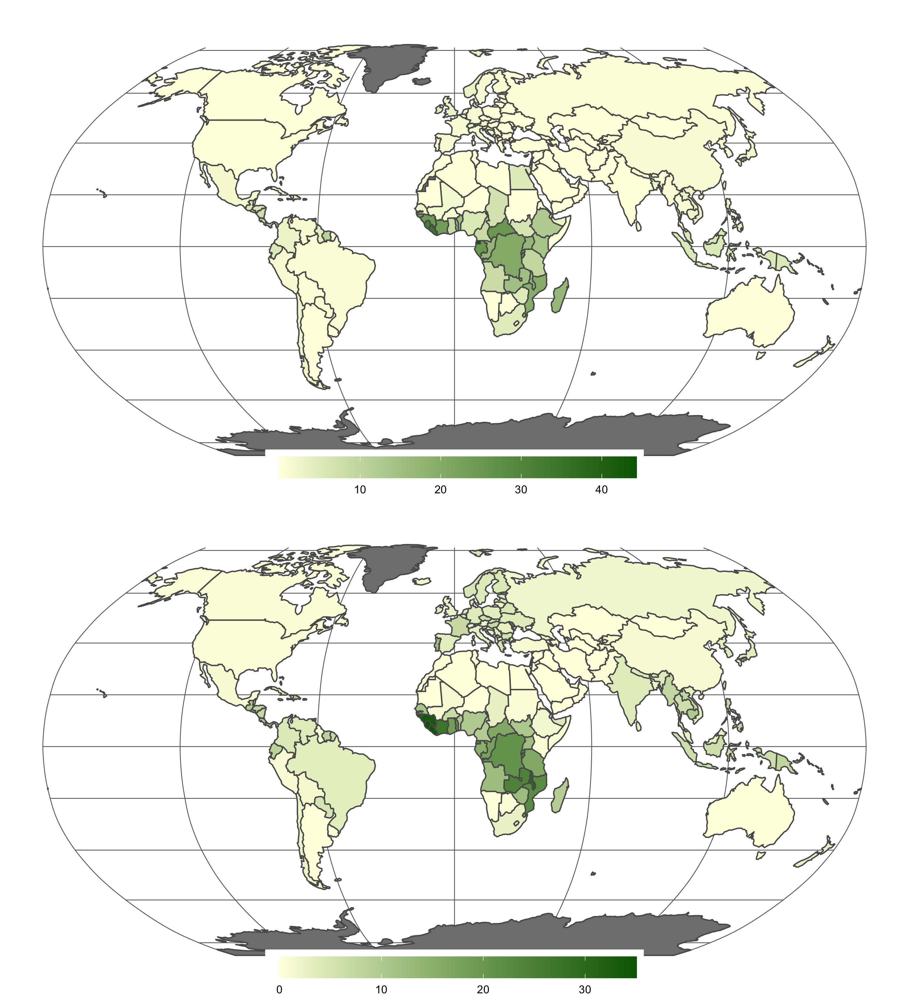
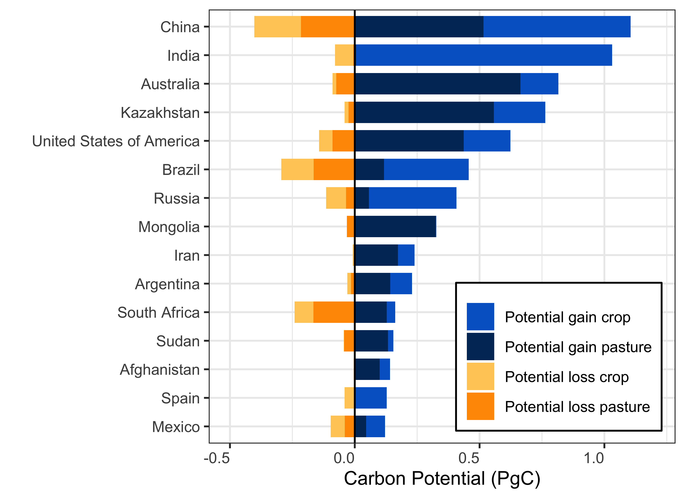
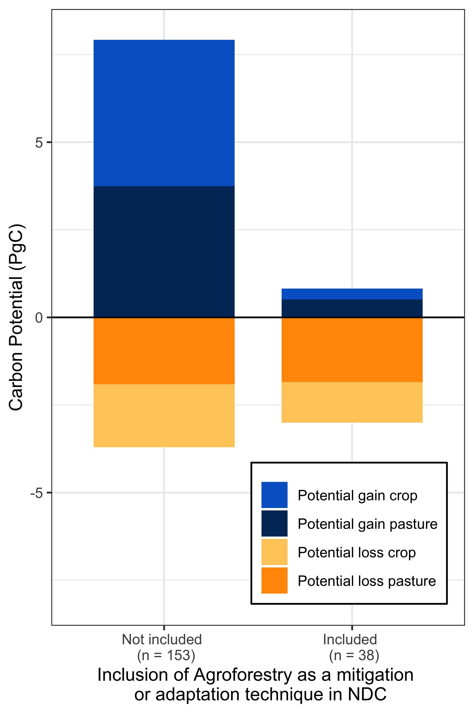
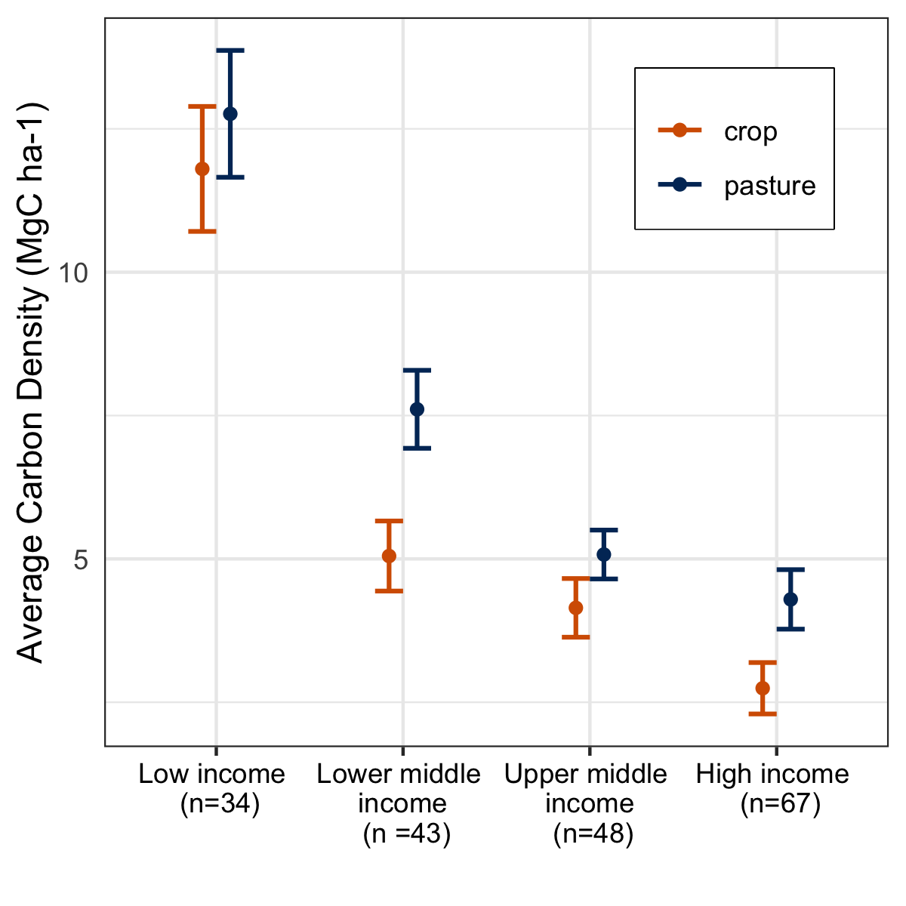
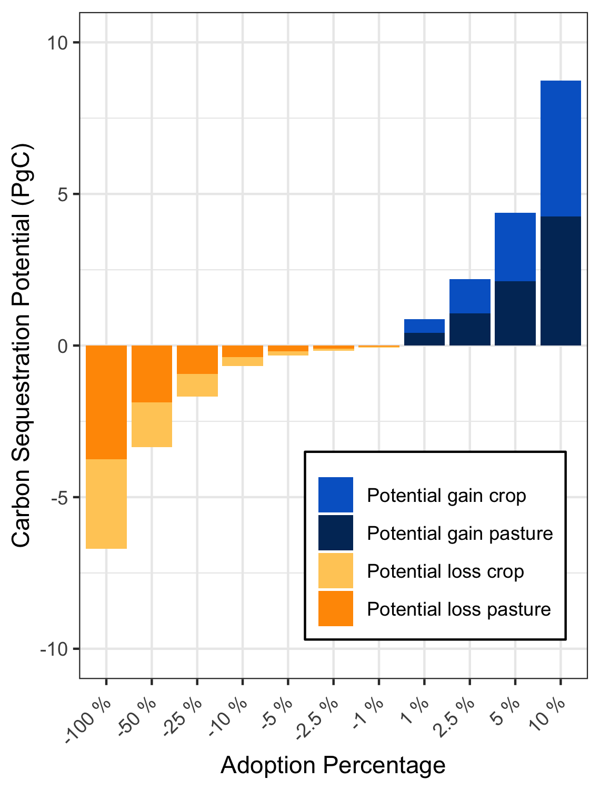
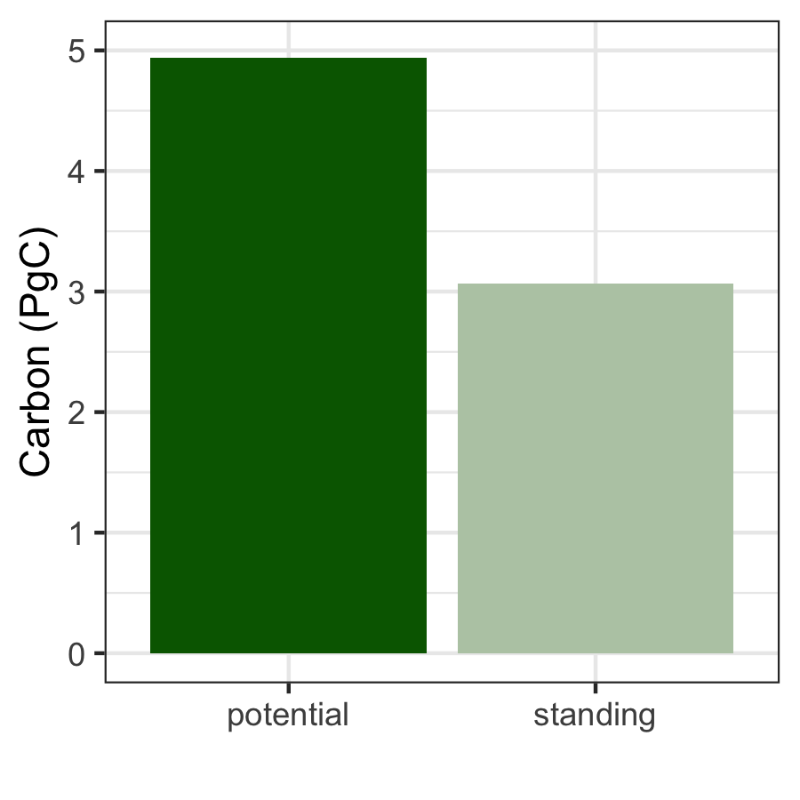
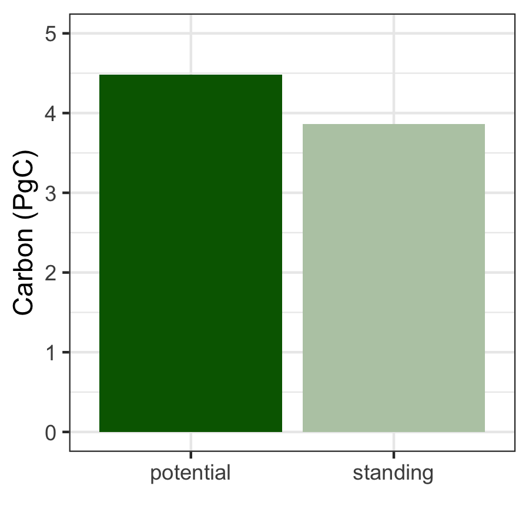

Figures
================
Millie Chapman
12/14/2019

``` r
library("rnaturalearth")
library("rnaturalearthdata")
library(tidyverse)
```

    ## ── Attaching packages ─────────────────────────────────────── tidyverse 1.3.0 ──

    ## ✓ ggplot2 3.2.1.9000     ✓ purrr   0.3.3     
    ## ✓ tibble  2.1.3          ✓ dplyr   0.8.3     
    ## ✓ tidyr   1.0.0          ✓ stringr 1.4.0     
    ## ✓ readr   1.3.1          ✓ forcats 0.4.0

    ## ── Conflicts ────────────────────────────────────────── tidyverse_conflicts() ──
    ## x dplyr::filter() masks stats::filter()
    ## x dplyr::lag()    masks stats::lag()

``` r
library(gridExtra)
```

    ## 
    ## Attaching package: 'gridExtra'

    ## The following object is masked from 'package:dplyr':
    ## 
    ##     combine

``` r
IUCN_agroforestry  <- read.csv("../data/IUCN_ndc_agroforestry.csv") %>% select(Agroforestry, ISO_A3)

summary_country <-read_csv("../output/summary_country.csv") %>%
  left_join(IUCN_agroforestry) %>%
  rename(IUCN = Agroforestry)
```

    ## Warning: Missing column names filled in: 'X1' [1]

    ## Parsed with column specification:
    ## cols(
    ##   X1 = col_double(),
    ##   NAME_EN = col_character(),
    ##   ISO_A3 = col_character(),
    ##   INCOME_GRP = col_character(),
    ##   biomass_crop = col_double(),
    ##   biomass_pasture = col_double(),
    ##   area_crop = col_double(),
    ##   area_pasture = col_double(),
    ##   total_area = col_double(),
    ##   total_biomass = col_double(),
    ##   density_crop = col_double(),
    ##   density_pasture = col_double()
    ## )

    ## Joining, by = "ISO_A3"

    ## Warning: Column `ISO_A3` joining character vector and factor, coercing into
    ## character vector

``` r
summary_country <- summary_country %>%
  mutate(iso_a3 = ISO_A3,
         admin = NAME_EN) 

world <- ne_countries(scale = "small", returnclass = "sf") %>%
  left_join(summary_country, by = "iso_a3") %>%
  select(iso_a3, density_crop, density_pasture, IUCN) 

quantile_crop <- quantile(world$density_crop, na.rm = TRUE)
```

``` r
crop <- ggplot(data = world) +
  geom_sf(aes(fill = density_crop))  +
  scale_fill_gradient(low = "lightyellow",
                      high = "darkgreen",space = "Lab",
                      na.value = "grey50", guide = "colourbar", aesthetics = "fill") +
  coord_sf(crs = "+proj=robin +lon_0=0w") + theme_minimal() + 
  theme(legend.direction = "horizontal", 
        legend.position = c(0.5, 0),
        legend.title = element_blank(),
        legend.background = element_rect(fill="white",  size=0, linetype="dotted")) +
  theme(legend.key.width = unit(2, "cm")) +
  theme(panel.grid.major = element_line(color = gray(.4), size = 0.3))


pasture <- ggplot(data = world) +
  geom_sf(aes(fill = density_pasture))  +
  scale_fill_gradient(low = "lightyellow",
                      high = "darkgreen",space = "Lab",
                      na.value = "grey50", guide = "colourbar", aesthetics = "fill") +
  coord_sf(crs = "+proj=robin +lon_0=0w") + theme_minimal() + 
  theme(legend.direction = "horizontal", 
        legend.position = c(0.5, 0),
        legend.title = element_blank(),
        legend.background = element_rect(fill="white",  size=0, linetype="dotted")) +
  theme(legend.key.width = unit(2, "cm")) +
  theme(panel.grid.major = element_line(color = gray(.4), size = 0.3))

grid.arrange(crop, pasture, ncol = 1)
```

<!-- -->

``` r
potential_c <- read.csv("../output/potential.csv") %>% group_by(ISO_A3, CP) %>% summarize(potential = sum(carbon_potential)) %>%
  spread(CP, potential, fill = NA, convert = FALSE)

standing_c <- read_csv("../output/summary_country.csv")  %>% left_join(potential_c, by = c("ISO_A3")) %>%
  rename(potential_crop = crop,
         potential_pasture = pasture) %>%
  mutate(total_potential = potential_crop + potential_pasture)
```

    ## Warning: Missing column names filled in: 'X1' [1]

    ## Parsed with column specification:
    ## cols(
    ##   X1 = col_double(),
    ##   NAME_EN = col_character(),
    ##   ISO_A3 = col_character(),
    ##   INCOME_GRP = col_character(),
    ##   biomass_crop = col_double(),
    ##   biomass_pasture = col_double(),
    ##   area_crop = col_double(),
    ##   area_pasture = col_double(),
    ##   total_area = col_double(),
    ##   total_biomass = col_double(),
    ##   density_crop = col_double(),
    ##   density_pasture = col_double()
    ## )

    ## Warning: Column `ISO_A3` joining character vector and factor, coercing into
    ## character vector

``` r
write.csv(standing_c, "../output/summary_potential_standing.csv")
```

``` r
IUCN <- read_csv("../output/summary_all.csv") %>%
  left_join(IUCN_agroforestry, by = c("ISO_A3")) %>%
  select(Agroforestry, area_pasture, area_crop, biomass_pasture, biomass_crop) %>%
  #mutate(mitigation = as.factor(mitigation)) %>%
  #mutate_all(funs(ifelse(is.na(.), 0, .))) %>%
  group_by(Agroforestry) %>%
  summarise(pasture = sum(biomass_pasture, na.rm = TRUE)/1000,
            crop = sum(biomass_crop, na.rm = TRUE)/1000) %>%
  gather(-Agroforestry, key = "CP", value = "carbon_standing")
```

    ## Warning: Missing column names filled in: 'X1' [1]

    ## Parsed with column specification:
    ## cols(
    ##   X1 = col_double(),
    ##   BIOME_NAME = col_character(),
    ##   NAME_EN = col_character(),
    ##   ISO_A3 = col_character(),
    ##   INCOME_GRP = col_character(),
    ##   area_crop = col_double(),
    ##   biomass_crop = col_double(),
    ##   area_pasture = col_double(),
    ##   biomass_pasture = col_double(),
    ##   total_area = col_double(),
    ##   total_biomass = col_double(),
    ##   density_crop = col_double(),
    ##   density_pasture = col_double()
    ## )

    ## Warning: Column `ISO_A3` joining character vector and factor, coercing into
    ## character vector

``` r
IUCN_agroforestry %>% group_by(Agroforestry) %>% count()
```

    ## # A tibble: 2 x 2
    ## # Groups:   Agroforestry [2]
    ##   Agroforestry     n
    ##          <int> <int>
    ## 1            0   153
    ## 2            1    38

``` r
IUCN_potential <- read.csv("../output/potential.csv") %>% left_join(IUCN_agroforestry, by = c("ISO_A3")) %>%
  select(carbon_potential, CP, Agroforestry) %>%
  #mutate_all(funs(ifelse(is.na(.), 0, .))) %>%
  #select(mitigation.y, carbon_potential, CP) %>%
  #mutate(mitigation = as.factor(mitigation.y)) %>%
  #mutate_all(funs(ifelse(is.na(.), 0, mitigation))) %>%
  group_by(Agroforestry, CP) %>%
  summarise(carbon_potential = sum(carbon_potential, na.rm = TRUE)/10^9/10) %>%
  left_join(IUCN, by = c("Agroforestry","CP"))
```

    ## Warning: Column `ISO_A3` joining factors with different levels, coercing to
    ## character vector

    ## Warning: Column `CP` joining factor and character vector, coercing into
    ## character vector

``` r
sum(IUCN_potential$carbon_standing)/10^6
```

    ## [1] 6.94822

``` r
IUCN_pot_all <- IUCN_potential
IUCN_potential<- IUCN_potential %>% remove_missing() %>%
  rename(NDC = Agroforestry)
```

    ## Warning: Removed 2 rows containing missing values.

``` r
standing <- read.csv("../output/summary_all.csv") %>%
  select(NAME_EN, ISO_A3, biomass_pasture, biomass_crop) %>%
  #mutate(mitigation = as.factor(mitigation)) %>%
  ##mutate_all(funs(ifelse(is.na(.), 0, .))) %>%
  group_by(ISO_A3) %>%
  summarise(pasture_loss = sum(biomass_pasture/10^6, na.rm = TRUE)*(-1),
            crop_loss = sum(biomass_crop/10^6, na.rm = TRUE)*(-1)) %>%
  gather(-ISO_A3, key = "CP", value = "standing") %>%
  #mutate(mitigation = as.factor(mitigation)) %>%
  group_by(ISO_A3, CP) %>%
  summarise(carbon= sum(standing)/1000) %>%
  mutate(CP = as.factor(CP))
```

    ## Warning: Factor `ISO_A3` contains implicit NA, consider using
    ## `forcats::fct_explicit_na`
    
    ## Warning: Factor `ISO_A3` contains implicit NA, consider using
    ## `forcats::fct_explicit_na`
    
    ## Warning: Factor `ISO_A3` contains implicit NA, consider using
    ## `forcats::fct_explicit_na`

``` r
countries1<-read.csv("../output/potential.csv") %>%
  select(ISO_A3, carbon_potential, CP) %>%
  #mutate(mitigation = as.factor(mitigation)) %>%
  ##mutate_all(funs(ifelse(is.na(.), 0, .))) %>%
  group_by(ISO_A3, CP) %>%
  summarise(carbon = sum(carbon_potential, na.rm = TRUE)/10^9/10)

totals <-read.csv("../output/potential.csv") %>%
  select(ISO_A3, carbon_potential, CP) %>%
  group_by(ISO_A3) %>%
  summarise(total = sum(carbon_potential, na.rm = TRUE)) %>% arrange(-total) %>%
  top_n(15) 
```

    ## Selecting by total

``` r
fig_data <-rbind(standing, countries1)
```

    ## Warning in bind_rows_(x, .id): Unequal factor levels: coercing to character

    ## Warning in bind_rows_(x, .id): binding character and factor vector, coercing
    ## into character vector
    
    ## Warning in bind_rows_(x, .id): binding character and factor vector, coercing
    ## into character vector

    ## Warning in bind_rows_(x, .id): Unequal factor levels: coercing to character

    ## Warning in bind_rows_(x, .id): binding character and factor vector, coercing
    ## into character vector
    
    ## Warning in bind_rows_(x, .id): binding character and factor vector, coercing
    ## into character vector

``` r
names <- read.csv("../output/summary_all.csv") %>%
  select(NAME_EN, ISO_A3)

fig <- totals %>% left_join(fig_data) %>%
  left_join(names) %>% distinct()
```

    ## Joining, by = "ISO_A3"

    ## Warning: Column `ISO_A3` joining factor and character vector, coercing into
    ## character vector

    ## Joining, by = "ISO_A3"

    ## Warning: Column `ISO_A3` joining character vector and factor, coercing into
    ## character vector

``` r
cbPalette <- c("#999999", "#E69F00", "#56B4E9", "#009E73", "#F0E442", "#0072B2", "#D55E00", "#CC79A7")

fig %>%
  group_by(CP) %>%
  summarize(carbon = sum(carbon))
```

    ## # A tibble: 4 x 2
    ##   CP           carbon
    ##   <chr>         <dbl>
    ## 1 crop          3.31 
    ## 2 crop_loss    -0.749
    ## 3 pasture       3.40 
    ## 4 pasture_loss -0.913

``` r
levels(fig$NAME_EN) <- c(levels(fig$NAME_EN), "China")
fig$NAME_EN[fig$NAME_EN == "People's Republic of China"] <- 'China'

fig$CP <- factor(fig$CP, levels = c("crop", "pasture", "crop_loss", "pasture_loss"))

fig %>% ggplot(aes(reorder(NAME_EN, total), carbon)) +
  geom_col(aes(fill = CP), width = 0.75) + coord_flip() +   labs(x = "",y = "Carbon Potential (PgC)", sep = "")+ theme_bw() +
  theme(legend.title = element_blank()) + theme() + theme(legend.position = c(0.75, 0.2)) +
  scale_fill_manual(labels = c("Potential gain crop", "Potential gain pasture", "Potential loss crop", "Potential loss pasture"), values = c("#0066CC", "#003366", "#FFCC66", "#FF9900")) +
  theme(axis.text.x = element_text(angle = 0, hjust = 1)) +
  ylim(-0.5,1.2) +
  geom_hline(yintercept=0, size = .5)  +
  theme(legend.background = element_rect(colour = 'black', fill = 'white', linetype='solid'))
```

<!-- -->

``` r
IUCN_potential$NDC <- ifelse(IUCN_potential$NDC == 0, "Not included \n (n = 153)", "Included \n (n = 38)")
IUCN_potential1 <- IUCN_potential
IUCN_potential$CP <- factor(IUCN_potential$CP, levels = c("crop", "pasture", "crop_loss", "pasture_loss"))

IUCN_potential<- IUCN_potential %>%
  mutate(carbon_standing = (-1)*carbon_standing/10^6) %>%
  gather(-NDC,  -CP,  key = "key", value = "value") %>%
  mutate(CP = paste(CP, key, sep = "_")) 

IUCN_potential$CP <- factor(IUCN_potential$CP, levels = c("crop_carbon_potential", "pasture_carbon_potential", "crop_carbon_standing", "pasture_carbon_standing"))

IUCN_potential %>%
  ggplot(aes(reorder(NDC, -value), value)) + geom_col(aes(fill = CP), width=.75) + ylim(-8,8) +
  labs(x = "Inclusion of Agroforestry as a mitigation \n or adaptation technique in NDC",y = "Carbon Potential (PgC)", sep = "")+
  theme_bw() + theme(legend.position = c(0.72, 0.15)) +
  theme(legend.title = element_blank()) +
  scale_fill_manual(labels = c("Potential gain crop", "Potential gain pasture", "Potential loss crop", "Potential loss pasture"), values = c("#0066CC", "#003366", "#FFCC66", "#FF9900")) +
  theme(axis.text.x = element_text(angle = 0, hjust = 0.5)) + geom_hline(yintercept=0,size = 0.5) +
  theme(legend.background = element_rect(colour = 'black', fill = 'white', linetype='solid'))
```

<!-- -->

``` r
IUCN_potential1 %>%
  group_by(NDC) %>%
  summarise(potential = sum(carbon_potential),
            standing = sum(carbon_standing)/10^6)
```

    ## # A tibble: 2 x 3
    ##   NDC                         potential standing
    ##   <chr>                           <dbl>    <dbl>
    ## 1 "Included \n (n = 38)"          0.822     3.00
    ## 2 "Not included \n (n = 153)"     7.92      3.71

``` r
3.7/6.9
```

    ## [1] 0.5362319

``` r
7.9/9.4
```

    ## [1] 0.8404255

``` r
153+38
```

    ## [1] 191

``` r
##"#56B4E9", "#009E73", "#F0E442", "#0072B2", "#D55E00", "#CC79A7")
## figure 2: Econ chart
read.csv("../output/summary_all.csv") %>%
  group_by(NAME_EN, INCOME_GRP) %>% summarise(biomass = 1) %>% remove_missing() %>%
  group_by(INCOME_GRP) %>%
  tally()
```

    ## Warning: Factor `NAME_EN` contains implicit NA, consider using
    ## `forcats::fct_explicit_na`

    ## Warning: Factor `INCOME_GRP` contains implicit NA, consider using
    ## `forcats::fct_explicit_na`

    ## Warning: Factor `NAME_EN` contains implicit NA, consider using
    ## `forcats::fct_explicit_na`

    ## Warning: Removed 1 rows containing missing values.

    ## # A tibble: 5 x 2
    ##   INCOME_GRP                  n
    ##   <fct>                   <int>
    ## 1 1. High income: OECD       35
    ## 2 2. High income: nonOECD    46
    ## 3 3. Upper middle income     58
    ## 4 4. Lower middle income     59
    ## 5 5. Low income              41

``` r
econ <- read_csv("../output/summary_all.csv") %>%
  select(NAME_EN, BIOME_NAME, INCOME_GRP, density_pasture, density_crop) %>% drop_na() %>%
  rename(pasture = density_pasture,
         crop = density_crop) %>%
  mutate(ECONOMY = factor(ifelse(INCOME_GRP == "1. High income: OECD" , "High income \n (n=67)",
                                 ifelse(INCOME_GRP == "2. High income: nonOECD", "High income \n (n=67)",
                                    ifelse(INCOME_GRP == "5. Low income", "Low income \n (n=34)",
                                        ifelse(INCOME_GRP =="4. Lower middle income", 
                                               "Lower middle \n income \n (n =43)",
                                               "Upper middle \n income \n (n=48)"
                                               )))))) %>%
  gather(CP,value,pasture:crop) %>%
  group_by(CP, ECONOMY) %>% 
  summarise(mean_density = mean(value),  # calculates the mean of each group
            sd = sd(value), # calculates the standard deviation of each group
            n_cb = n(),  # calculates the sample size per group
            se = sd(value)/sqrt(n()))
```

    ## Warning: Missing column names filled in: 'X1' [1]

    ## Parsed with column specification:
    ## cols(
    ##   X1 = col_double(),
    ##   BIOME_NAME = col_character(),
    ##   NAME_EN = col_character(),
    ##   ISO_A3 = col_character(),
    ##   INCOME_GRP = col_character(),
    ##   area_crop = col_double(),
    ##   biomass_crop = col_double(),
    ##   area_pasture = col_double(),
    ##   biomass_pasture = col_double(),
    ##   total_area = col_double(),
    ##   total_biomass = col_double(),
    ##   density_crop = col_double(),
    ##   density_pasture = col_double()
    ## )

``` r
ggplot(econ, aes(x=reorder(ECONOMY, -mean_density), 
               y=mean_density, 
               color=CP)) + 
  geom_errorbar(aes(ymin=mean_density-se, 
                    ymax=mean_density+se), 
                width=.3, size=0.7, position=position_dodge(.3)) +
  geom_point(position=position_dodge(.3)) +
  theme_bw() + ylab("Average Carbon Density (MgC ha-1)")+ xlab("")+
  scale_color_manual(values = c("#D55E00","#003366"))+
  theme(legend.title=element_blank()) +
  theme(legend.justification = c(1, 1), legend.position = c(0.93, 0.93),
        legend.box.background = element_rect(colour = "black"))+
  theme( 
    axis.text.x = element_text(color='black'),
    axis.ticks.y = element_blank(),
    axis.title.x = element_text(size=11,color='black')
  )
```

<!-- -->

``` r
potential<- IUCN_potential1 %>%
  group_by(CP) %>% 
  summarise(`100 % ` = sum(carbon_potential)*10,
            `-100 % ` = sum(carbon_standing)*(-1)/10^6) %>%
  mutate(`10 % ` = `100 % `*0.1,
         `5 % ` = `100 % `*0.05,
         `2.5 % ` = `100 % `*0.025,
         `1 % ` = `100 % `*0.01,
         `-50 % ` = `-100 % `*0.5,
         `-25 % ` = `-100 % `*0.25,
         `-10 % ` = `-100 % `*0.1,
         `-5 % ` = `-100 % `*0.05,
         `-2.5 % ` = `-100 % `*0.025,
         `-1 % ` = `-100 % `*0.01,) %>%
  gather(Adoption,value,`-100 % `:`-1 % `) %>%
  mutate(color = ifelse(value < 0 & CP == "crop", "trees in crop loss",
                        ifelse(value < 0 & CP == "pasture", "trees in pasture loss",
                               ifelse(value >0 & CP == "crop", "trees in crop gain", "trees in pasture gain"))))%>%
  mutate(color = as.factor(color))

potential$color <- factor(potential$color, levels = c("trees in crop gain", "trees in pasture gain", "trees in crop loss", "trees in pasture loss"))

potential %>% 
  ggplot(aes(reorder(Adoption, value), value)) +
  geom_col(aes(fill = color))+theme_bw() + scale_fill_manual(labels = c("Potential gain crop", "Potential gain pasture", "Potential loss crop", "Potential loss pasture"), values = c("#0066CC", "#003366", "#FFCC66", "#FF9900")) +
  labs(x = "Adoption Percentage",y = "Carbon Sequestration Potential (PgC)", sep = "")+
  theme(legend.title = element_blank()) + ylim(-10, 10) +
  theme(axis.text.x = element_text(angle = 45, hjust = 1))+
  theme(legend.position = c(0.7, 0.2)) +
  theme(legend.background = element_rect(colour = 'black', fill = 'white'))
```

<!-- -->

``` r
abstract<- read.csv("../data/abstract.csv")
```

    ## Warning in read.table(file = file, header = header, sep = sep, quote = quote, :
    ## incomplete final line found by readTableHeader on '../data/abstract.csv'

``` r
abstract %>% filter(CP == "crop") %>%
  #gather(-CP, key = "key", value = "value") %>%
  ggplot(aes(SP, Value)) +
  geom_bar(aes(fill = SP), stat = "identity") +
  theme_bw() +
  labs(x = "",y = "Carbon (PgC)", sep = "")+
  theme(legend.title = element_blank()) + ylim(0, 5) +
  scale_fill_manual(values = c("#006400","#B8CAB2")) +
 # theme(axis.text.x = element_text(angle = 0, hjust = 1)) +  
  theme(legend.position = "none")
```

<!-- -->

``` r
abstract %>% filter(CP == "pasture") %>%
  #gather(-CP, key = "key", value = "value") %>%
  ggplot(aes(SP, Value)) +
  geom_bar(aes(fill = SP), stat = "identity") +
  theme_bw() +
  labs(x = "",y = "Carbon (PgC)", sep = "")+
  theme(legend.title = element_blank()) + ylim(0, 5) +
  scale_fill_manual(values = c("#006400","#B8CAB2")) +
 # theme(axis.text.x = element_text(angle = 0, hjust = 1)) +  
  theme(legend.position = "none")
```

<!-- -->
